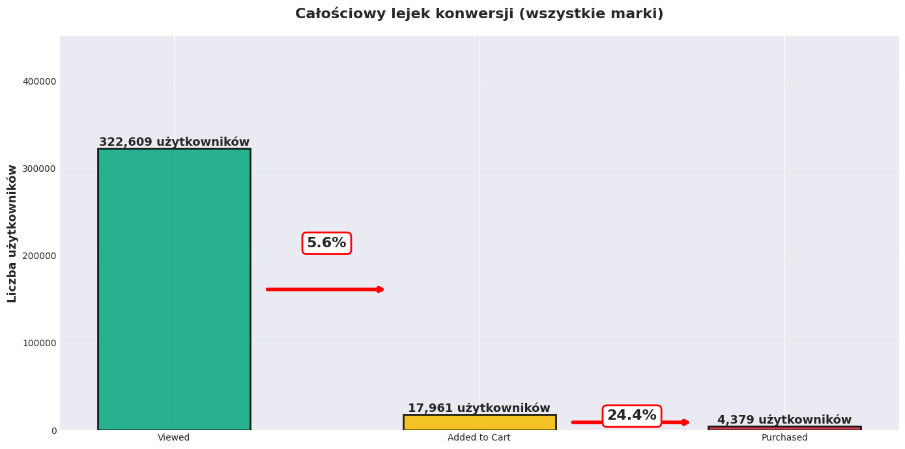
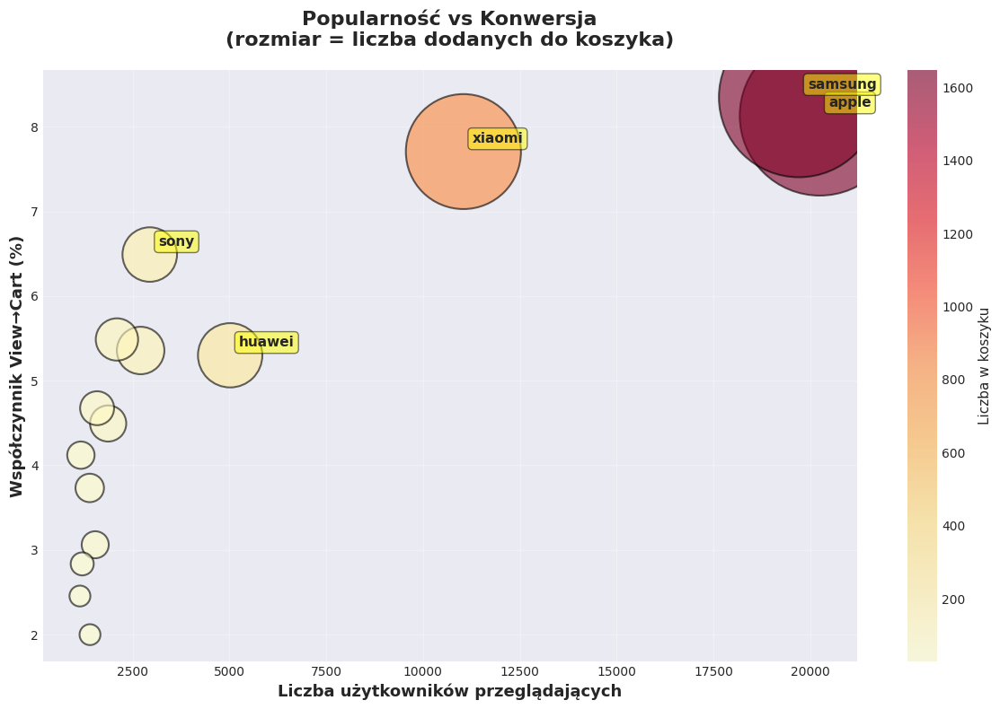

# E-commerce Recommendation System with Apache and Google Cloud Platform

## Business Objectives

System is designed for medium and large e-commerce platforms handling millions of users and tens of thousands of products. It solves three key business challenges:

1. **Generate personalized product recommendations** based on user demographic profiles
2. **Analyze customer conversion paths** and identify purchase abandonment points
3. **Monitor trends in real-time** enabling immediate marketing responses

## Analysis Results and Visualizations

Complete analysis results, visualizations, and interactive dashboards are located in: **`ecommerce_analytics.ipynb`**

### Key Charts and Visualizations

Below are example charts from many generated during the analysis:

#### Conversion Analytics


#### Popularity vs Conversion Analysis


## Data Sources

System utilizes three data sources:

### Streaming Data
- User activity from December 2019 (9.2 GB, 67,542,878 observations)
  - 62,986,067 views
  - 3,394,763 add-to-cart events
  - 1,162,048 purchases

### Batch Data 1
- Product catalog (205,230 products across 1,162 categories)

### Batch Data 2
- User profiles (5,000,000 records, 370 MB)

## System Architecture


System is based on Lambda architecture with three layers:

### Speed Layer - Real-time Stream Processing
- Apache Kafka as streaming buffer
- Spark Streaming for real-time analysis
- Five parallel analyses: active users, top 10 products, purchase metrics, event distribution, top 10 brands

### Batch Layer - Batch Processing
- Apache Airflow for workflow orchestration
- HDFS as distributed file system
- Apache Hive for metadata management
- Apache Spark for batch analytics:
  - Customer conversion path analysis
  - Demographic recommendations
  - Brand performance analysis

### Serving Layer - Service Layer
- Apache HBase for pre-computed results with millisecond latency

## Technology Stack

Main components deployed in the environment:

- Apache Hadoop 3.3.6 (HDFS)
- Apache Spark 3.5.3 (analytics engine)
- Apache Kafka 3.6.1 (event bus)
- Apache Hive 3.1.3 (data warehouse)
- Apache HBase 2.6.4-hadoop3 (service layer)
- Apache Airflow 2.8.1 (orchestrator)
- Java 17 (OpenJDK 17.0.10)

## Deployment Environment

System is deployed on Google Cloud Platform:

- **Region:** Europe Central 2 (Warsaw)
- **Instance:** bigdata-vm, type n1-standard-4
- **Operating System:** Ubuntu 22.04.5 LTS
- **Resources:** 4 vCPU (Intel Xeon 2.20 GHz), 14 GB RAM, 194 GB disk

## Airflow Data Pipelines

System implements eight main DAGs:

1. **realtime_ecommerce_stream** (@daily) - Simulates user event stream from CSV ingestion to Kafka
2. **kafka_to_hdfs_archiver** (@hourly) - Archives data from Kafka to HDFS with time-based partitioning
3. **realtime_analytics_manager** - Orchestrates Spark Streaming tasks
4. **funnel_analysis_daily** - Daily customer conversion path analysis
5. **demographic_recommendations_daily** - Daily demographic-based recommendation generation
6. **brand_performance_daily** - Weekly brand efficiency analysis
7. **products_batch_pipeline** - Batch processing of product catalog data
8. **users_batch_pipeline** - Batch processing of user profiles

## Key Features

### Data Stream Simulation
- Time mapping of events from December 2019 to December 2025/January 2026
- Kafka publication maintaining natural pace (~15 events/second)
- User ID-based partitioning ensuring event order preservation

### Real-time Stream Analysis
- Five-minute sliding time windows
- Results written to HBase for fast access
- Monitoring active users, popular products, and purchase metrics

### HDFS Archiving
- Batch processing after 250,000 events
- Parquet format with Snappy compression
- Hierarchical partitioning: `/raw/events/year=YYYY/month=MM/day=DD/hour=HH`

### Customer Conversion Path Analysis
- Identification of user paths: view → cart → purchase
- Drop-off rate calculation by category and brand
- Average time between conversion stages

### Demographic Recommendations
- User segmentation by age (5 groups: 18-24, 25-34, 35-44, 45-54, 55+) and region
- Recommendation score = views + 2×add_to_cart + 5×purchases
- Top 10 products for each segment

### Brand Performance Analysis
- Top 100 brands by revenue monitoring
- Metrics: unique users, total views, purchases, revenue, conversion rate
- Analysis by age group

## Security

After a botnet attack incident, firewall configuration was strengthened:

- Restricted access to internal ports (Kafka 9092, Zookeeper 2181, HBase Thrift 9090)
- Public access only to UI: Airflow (8080), HDFS (9870), YARN (8088)
- SSH tunneling for internal service access

## System Metrics

Status as of December 30, 2025:

- **HDFS Archive:** 224.9 MB of event data
- **HBase realtime_stats:** 67,114 metric rows
- **Stability:** System running stable for 9+ days without interruption
- **Throughput:** Simulator processing ~15 events/second for 14+ hours

## Project Structure

```
E-CommerceBigDataSystem/
├── ecommerce_analytics.ipynb          # Analysis results and visualizations
├── preprocessing.ipynb                 # Data preprocessing
├── airflow_dags/                       # Airflow DAGs
├── analytics_scripts/                  # Analytics scripts
├── data/                               # Input data
├── scripts/                            # Helper scripts
├── sql/                                # SQL and Spark queries
└── README.md                           # This file
```

---

*Project developed by KGW Gawron team - January 7, 2026*

## Project Information

**Team:** KGW Gawron  
**Authors:**
- [Natalia Choszczyk](https://github.com/nataliachoszczyk)
- [Mikołaj Rowicki](https://github.com/MikolajRowicki)
- [Filip Langiewicz](https://github.com/FilipLangiewicz)

**Date:** January 7, 2026
