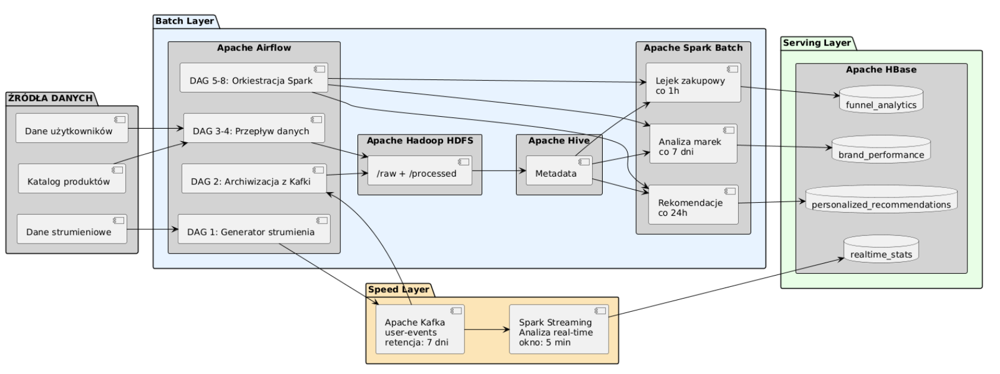

# System rekomendacyjny dla platformy e-commerce z wykorzystaniem narzędzi Apache i Google Cloud Platform

## Cel biznesowy

System przeznaczony jest dla średnich i dużych platform e-commerce obsługujących miliony użytkowników i dziesiątki tysięcy produktów. Rozwiązuje trzy kluczowe problemy biznesowe:

1. **Generowanie spersonalizowanych rekomendacji produktowych** w oparciu o profil demograficzny użytkownika
2. **Analiza ścieżki konwersji użytkownika** i identyfikacja momentów porzucania zakupów
3. **Monitoring trendów w czasie rzeczywistym** umożliwiający natychmiastowe reakcje marketingowe

## Wyniki analiz i wizualizacje

Kompletne wyniki analiz, wizualizacje i interaktywne pulpity znajdują się w pliku: **`ecommerce_analytics.ipynb`**

## Źródła danych

System wykorzystuje trzy źródła danych:

### Dane strumieniowe
- Aktywność użytkowników z grudnia 2019 roku (9,2 GB, 67 542 878 obserwacji)
  - 62 986 067 wyświetleń (view)
  - 3 394 763 dodań do koszyka (cart)
  - 1 162 048 zakupów (purchase)

### Dane wsadowe 1
- Katalog produktów (205 230 produktów w 1162 kategoriach)

### Dane wsadowe 2
- Profile użytkowników (5 000 000 rekordów, 370 MB)

## Architektura systemu



System oparty jest na architekturze Lambda z trzema warstwami:

### Speed Layer - przetwarzanie strumieniowe w czasie rzeczywistym
- Apache Kafka jako bufor strumieniowy
- Spark Streaming do analizy w czasie rzeczywistym
- Pięć równoległych analiz: aktywni użytkownicy, top 10 produktów, metryki zakupów, rozkład zdarzeń, top 10 marek

### Batch Layer - przetwarzanie wsadowe
- Apache Airflow do orkiestracji przepływów
- HDFS jako rozproszony system plików
- Apache Hive do zarządzania metadanymi
- Apache Spark do analiz wsadowych:
  - Analiza ścieżki konwersji użytkownika
  - Rekomendacje demograficzne
  - Analiza efektywności marek

### Serving Layer - warstwa serwisowa
- Apache HBase do przechowywania wstępnie obliczonych wyników

## Stos technologiczny

Główne komponenty zainstalowane w środowisku:

- Apache Hadoop 3.3.6 (HDFS)
- Apache Spark 3.5.3 (silnik analityczny)
- Apache Kafka 3.6.1 (magistrala zdarzeń)
- Apache Hive 3.1.3 (hurtownia danych)
- Apache HBase 2.6.4-hadoop3 (warstwa serwisowa)
- Apache Airflow 2.8.1 (orkiestrator)
- Java 8 (OpenJDK 1.8.0_472)

## Środowisko wdrożeniowe

System został wdrożony na Google Cloud Platform:

- **Region:** Europe Central 2 (Warszawa)
- **Instancja:** bigdata-vm, typ n1-standard-4
- **System operacyjny:** Ubuntu 22.04.5 LTS
- **Zasoby:** 4 vCPU (Intel Xeon 2.20 GHz), 14 GB RAM, 194 GB dysku
- **IP:** wewnętrzny 10.186.0.2, zewnętrzny 34.116.216.172

## Przepływy danych w Airflow

System implementuje osiem głównych DAG-ów:

1. **realtime_ecommerce_stream** (@daily) - symulacja strumienia zdarzeń użytkowników z wczytywania CSV do Kafki
2. **kafka_to_hdfs_archiver** (@hourly) - archiwizacja danych z Kafki do HDFS z partycjonowaniem czasowym
3. **realtime_analytics_manager** - orkiestracja zadań Spark Streaming
4. **funnel_analysis_daily** - codzienna analiza ścieżki konwersji użytkownika
5. **demographic_recommendations_daily** - codzienne generowanie rekomendacji demograficznych
6. **brand_performance_daily** - tygodniowa analiza efektywności marek
7. **products_batch_pipeline** - przetwarzanie wsadowe danych katalogowych produktów
8. **users_batch_pipeline** - przetwarzanie wsadowe profili użytkowników

## Kluczowe funkcjonalności

### Symulacja strumienia danych
- Mapowanie czasowe zdarzeń z grudnia 2019 na grudzień 2025/styczeń 2026
- Publikacja do Kafka z zachowaniem naturalnego tempa (~15 zdarzeń/sekundę)
- Partycjonowanie według user_id zapewniające kolejność zdarzeń

### Analiza strumieniowa w czasie rzeczywistym
- Pięciominutowe okna czasowe przesuwane co minutę
- Zapis wyników do HBase dla błyskawicznego dostępu
- Monitoring aktywnych użytkowników, popularnych produktów i metryk zakupowych

### Archiwizacja do HDFS
- Przetwarzanie wsadowe po 250 000 zdarzeń
- Format Parquet z kompresją Snappy
- Hierarchiczne partycjonowanie: `/raw/events/year=YYYY/month=MM/day=DD/hour=HH`

### Analiza ścieżki konwersji użytkownika
- Identyfikacja ścieżek użytkowników: view → cart → purchase
- Obliczanie wskaźników drop-off rate z podziałem na kategorie i marki
- Średni czas między etapami konwersji

### Rekomendacje demograficzne
- Segmentacja użytkowników według wieku (5 grup: 18-24, 25-34, 35-44, 45-54, 55+) i regionu
- Recommendation score = views + 2×add_to_cart + 5×purchases
- Top 10 produktów dla każdego segmentu

### Analiza efektywności marek
- Monitoring top 100 marek według przychodu
- Metryki: unique users, total views, purchases, revenue, conversion rate
- Analiza z podziałem na grupy wiekowe

## Bezpieczeństwo

Po incydencie z atakiem botnetów wzmocniono konfigurację firewall:

- Ograniczenie dostępu do portów wewnętrznych (Kafka 9092, Zookeeper 2181, HBase Thrift 9090)
- Publiczny dostęp tylko do UI: Airflow (8080), HDFS (9870), YARN (8088)
- SSH tunneling dla dostępu do usług wewnętrznych

## Metryki systemu

Stan na 30 grudnia 2025:

- **Archiwum HDFS:** 224.9 MB danych zdarzeń
- **HBase realtime_stats:** 67 114 wierszy metryk
- **Stabilność:** System działa stabilnie przez 9+ dni bez przerw
- **Przepustowość:** Symulator procesuje ~15 zdarzeń/sekundę przez 14+ godzin

## Struktura projektu

```
E-CommerceBigDataSystem/
├── ecommerce_analytics.ipynb          # Wyniki analiz i wizualizacje
├── preprocessing.ipynb                 # Przetwarzanie danych
├── airflow_dags/                       # DAG-i Airflow
├── analytics_scripts/                  # Skrypty analityczne
├── data/                               # Dane wejściowe
├── scripts/                            # Skrypty pomocnicze
├── sql/                                # Zapytania SQL i Spark
└── README.md                           # Ten plik
```

---

*Projekt opracowany przez zespół KGW Gawron - 7 stycznia 2026*

## Informacje o projekcie

**Zespół:** KGW Gawron  
**Autorzy:**
- [Natalia Choszczyk](https://github.com/nataliachoszczyk)
- [Mikołaj Rowicki](https://github.com/MikolajRowicki)
- [Filip Langiewicz](https://github.com/FilipLangiewicz)

**Data:** 7 stycznia 2026 roku
